# Delly.Modeling

一个 .NET 建模库，通过源代码生成器提供对象建模能力。它支持在编译时进行类似反射的属性访问和操作。

## 文档地图

```
Delly.Modeling.docs
├─ 首页.md  # 项目首页MD
├─ 用户指南/  # 用户指南类MD
│  └─ 开始.md
├─ 开发指南/  # 开发指南类MD
│  ├─ 代码规范.md
│  └─ 注意事项.md
└─ 开发计划/  # 计划类MD
   ├─ 总计划.md
   └─ 2026.5/
      ├─ 功能清单.md
      └─ 1.建模处理/
         ├─ 1.1-查询对象建模支持/
         │  └─ 1.1-查询对象建模支持.md
         ├─ 1.2-建模工厂支持/
         │  └─ 1.2-建模工厂支持.md
         ├─ 1.3-建模集泛型支持/
         │  ├─ 1.3-建模集泛型支持.md
         │  └─ 1.3-需求补充.md
         ├─ 1.4-建模工厂泛型支持/
         │  ├─ 1.4-建模工厂泛型支持.md
         │  └─ 1.4-需求补充.md
         ├─ 1.5-建模创建对象/
         │  ├─ 1.5-建模创建对象.md
         │  └─ 1.5-需求补充.md
         ├─ 1.6-建模添加字段/
         │  ├─ 1.6-建模添加字段.md
         │  └─ 1.6-需求补充.md
         ├─ 1.7-建模属性添加PropertyType字段/
         │  ├─ 1.7-建模属性添加PropertyType字段.md
         │  └─ 1.7-需求补充.md
         ├─ 1.8-建模添加分析函数/
         │  ├─ 1.8-建模添加分析函数.md
         │  └─ 1.8-需求补充.md
         ├─ 1.9-建模可分析特性修改/
         │  ├─ 1.9-建模可分析特性修改.md
         │  └─ 1.9-需求补充.md
         └─ 1.10-编译警告处理/
            ├─ 1.10-编译警告处理.md
            └─ 1.10-需求补充.md
         └─ 1.11-建模属性添加读写标记/
            ├─ 1.11-建模属性添加读写标记.md
            └─ 1.11-需求补充.md
         └─ 1.12-建模对象添加属性/
            ├─ 1.12-建模对象添加属性.md
            └─ 1.12-需求补充.md
         └─ 1.13-Demo代码整理/
            ├─ 1.13-Demo代码整理.md
            └─ 1.13-需求补充.md
         └─ 1.14-建模工厂支持基础类型/
            ├─ 1.14-建模工厂支持基础类型.md
            └─ 1.14-需求补充.md
         └─ 1.15-代码规范整理/
            ├─ 1.15-代码规范整理.md
            └─ 1.15-需求补充.md
         └─ 1.16-nullable规范定义/
            ├─ 1.16-nullable规范定义.md
            └─ 1.16-需求补充.md
         └─ zl.1.17-泛型建模支持/
            ├─ zl.1.17-泛型建模支持.md
            └─ zl.1.17-需求补充.md
         └─ zl.1.18-泛型实体建模支持/
            ├─ zl.1.18-泛型实体建模支持.md
            └─ zl.1.18-需求补充.md
```

## 依赖关系

```mermaid
graph TD
    subgraph "Delly.Modeling 核心库"
        IBaseModel[IBaseModel<br/>基础模型接口]
        IModel[IModel<br/>模型接口]
        IModelProperty[IModelProperty<br/>模型属性接口]
        IEntityModel[IEntityModel<br/>实体模型接口]
        IEntityModelProperty[IEntityModelProperty<br/>实体属性接口]
        IEntityModelSet[IEntityModelSet<br/>实体模型集接口]
        IEntityModelFactory[IEntityModelFactory<br/>实体工厂接口]
        IBaseModel --> IModel
        IBaseModel --> IEntityModel
        IModelProperty -.-> IBaseModel
        IEntityModelProperty -.-> IModelProperty
        IEntityModel --> IBaseModel
        IEntityModelSet --> IEntityModel
        IEntityModelFactory --> IEntityModel
    end

    subgraph "源生成器 Delly.Modeling.Generator"
        MSG[ModelableSourceGenerator<br/>基础源生成器]
        MTSG[ModelTableSourceGenerator<br/>实体源生成器]
        MSSG[ModelSetSourceGenerator<br/>集合源生成器]
    end

    subgraph "类型模型 Models"
        StringModel[StringModel]
        Int32Model[Int32Model]
        Int64Model[Int64Model]
        BooleanModel[BooleanModel]
        DoubleModel[DoubleModel]
        DecimalModel[DecimalModel]
        DateTimeModel[DateTimeModel]
        GuidModel[GuidModel]
        StringModel --> IBaseModel
        Int32Model --> IBaseModel
        Int64Model --> IBaseModel
        BooleanModel --> IBaseModel
        DoubleModel --> IBaseModel
        DecimalModel --> IBaseModel
        DateTimeModel --> IBaseModel
        GuidModel --> IBaseModel
    end

    subgraph "演示应用 Deme"
        User[User<br/>用户类]
        UserEntity[UserEntity<br/>用户实体]
        UserQuery[UserQuery<br/>用户查询]
        EntityModelSet[EntityModelSet<br/>实体模型集合]
    end

    MSG --> IModel
    MSG --> IModelProperty
    MTSG --> IEntityModel
    MTSG --> IEntityModelProperty
    MSSG --> IEntityModelSet

    User -.-> IModel
    UserEntity -.-> IEntityModel
    UserQuery -.-> IEntityModel
    EntityModelSet -.-> IEntityModelSet
```



## 代码文件索引

```
Delly.Modeling
├─ 核心接口
│  ├─ IBaseModel.cs               # 模型基础接口，提供类型信息、实例创建、解析能力
│  ├─ IModel.cs                   # 模型接口，扩展属性访问和泛型模型支持
│  ├─ IModelProperty.cs           # 属性模型接口，提供属性访问能力
│  ├─ IParsable.cs                # 可解析类型接口，用于提供类型解析能力
│  ├─ IEntityModel.cs             # 实体模型接口，用于表结构建模
│  ├─ IEntityModelProperty.cs     # 实体属性接口，扩展列类型、长度等数据库元数据
│  ├─ IEntityModelSet.cs          # 实体模型集合接口，用于建模信息自动收集
│  └─ IEntityModelFactory.cs      # 实体模型工厂接口，定义实体建模管理标准
├─ 特性/Attributes
│  ├─ ModelableAttribute.cs       # 标记类以启用源代码生成
│  ├─ MoTableAttribute.cs         # 表建模特性，标记类生成实体模型
│  ├─ MoColumnAttribute.cs        # 列建模特性，定义列类型、长度、注释等
│  ├─ MoColumnIndexAttribute.cs   # 列索引特性，定义索引名称和唯一性
│  ├─ MoQueryAttribute.cs         # 查询对象特性，标记查询类生成实体模型
│  ├─ MoSetAttribute.cs           # 建模集合特性，标记类自动收集实体模型
│  └─ ParsableAttribute.cs        # Parser类型特性，指定类型解析器
├─ 基础类型/枚举
│  └─ ColumnType.cs               # 列类型枚举（UNSET、BOOL、INTEGER、LONG、DECIMAL、TIME、VARCHAR、TEXT）
├─ 工具类
│  ├─ ModelUtils.cs               # 建模工具类，提供静态辅助方法
│  ├─ DefaultEntityModelFactory.cs# 默认实体建模工厂实现
│  ├─ EntityModelIndex.cs         # 实体建模索引定义
│  └─ ConstructedGenericEntityModel.cs  # 已构造的泛型实体模型
└─ Models/ (基础类型模型实现)
   ├─ BooleanModel.cs             # Boolean类型模型实现
   ├─ StringModel.cs              # String类型模型实现
   ├─ Int32Model.cs               # Int32类型模型实现
   ├─ Int64Model.cs               # Int64类型模型实现
   ├─ DateTimeModel.cs            # DateTime类型模型实现
   ├─ DecimalModel.cs             # Decimal类型模型实现
   ├─ DoubleModel.cs              # Double类型模型实现
   ├─ GuidModel.cs                # Guid类型模型实现
   ├─ DictionaryModel.cs          # Dictionary<>泛型定义模型
   ├─ ListModel.cs                # List<>泛型定义模型
   └─ ConstructedGenericModel.cs  # 已构造的泛型模型

Delly.Modeling.EntityModels (实体模型适配器)
├─ BooleanEntityModel.cs          # Boolean实体模型适配器
├─ StringEntityModel.cs           # String实体模型适配器
├─ Int32EntityModel.cs            # Int32实体模型适配器
├─ Int64EntityModel.cs            # Int64实体模型适配器
├─ DateTimeEntityModel.cs         # DateTime实体模型适配器
├─ DecimalEntityModel.cs          # Decimal实体模型适配器
├─ DoubleEntityModel.cs           # Double实体模型适配器
├─ GuidEntityModel.cs             # Guid实体模型适配器
├─ ListEntityModel.cs             # List<>泛型实体定义模型
└─ DictionaryEntityModel.cs      # Dictionary<>泛型实体定义模型

Delly.Modeling.Generator (源代码生成器)
├─ ModelableSourceGenerator.cs     # [Modelable]特性源生成器
├─ ModelableSyntaxReceiver.cs      # 语法接收器，收集标记类
├─ ModelTableSourceGenerator.cs    # [MoTable]/[MoQuery]特性源生成器
├─ ModelTableSyntaxReceiver.cs     # 语法接收器，收集表/查询类
├─ ModelSetSourceGenerator.cs      # [MoSet]特性源生成器
└─ ModelSetSyntaxReceiver.cs       # 语法接收器，收集建模集合类

Deme (演示应用)
├─ Program.cs                # 程序入口
├─ User.cs                   # [Modelable] 演示用户类
├─ UserEntity.cs            # [MoTable] 演示实体类
├─ UserQuery.cs             # [MoQuery] 演示查询类
├─ ModelableDemo.cs         # [Modelable] 功能演示
├─ MoTableDemo.cs           # [MoTable] 功能演示
├─ MoQueryDemo.cs           # [MoQuery] 功能演示
├─ ModelSetDemo.cs          # [MoSet] 功能演示
├─ ModelFactoryDemo.cs      # 工厂功能演示
├─ BaseTypeModelDemo.cs     # 基础类型模型演示
├─ CreateInstanceDemo.cs    # 实例创建功能演示
└─ IsValueDemo.cs           # IsValue属性判断演示

NugetDemo (NuGet 包演示)
├─ Program.cs               # 程序入口
└─ User.cs                  # [Modelable] 演示用户类
```