# Delly.Modeling

一个 .NET 建模库，通过源代码生成器提供对象建模能力。它支持在编译时进行类似反射的属性访问和操作。

## 文档地图

```
Delly.Modeling.docs
├─ 首页.md  # 项目首页MD
├─ 用户指南/  # 用户指南类MD
│  └─ 开始.md
├─ 开发指南/  # 开发指南类MD
│  ├─ 代码规范.md
│  └─ 注意事项.md
└─ 开发计划/  # 计划类MD
   ├─ 总计划.md
   └─ 2026.5/
      ├─ 功能清单.md
      └─ 1.建模处理/
         ├─ 1.1-查询对象建模支持/
         │  └─ 1.1-查询对象建模支持.md
         ├─ 1.2-建模工厂支持/
         │  └─ 1.2-建模工厂支持.md
         ├─ 1.3-建模集泛型支持/
         │  ├─ 1.3-建模集泛型支持.md
         │  └─ 1.3-需求补充.md
         ├─ 1.4-建模工厂泛型支持/
         │  ├─ 1.4-建模工厂泛型支持.md
         │  └─ 1.4-需求补充.md
         ├─ 1.5-建模创建对象/
         │  ├─ 1.5-建模创建对象.md
         │  └─ 1.5-需求补充.md
         ├─ 1.6-建模添加字段/
         │  ├─ 1.6-建模添加字段.md
         │  └─ 1.6-需求补充.md
         ├─ 1.7-建模属性添加PropertyType字段/
         │  ├─ 1.7-建模属性添加PropertyType字段.md
         │  └─ 1.7-需求补充.md
         ├─ 1.8-建模添加分析函数/
         │  ├─ 1.8-建模添加分析函数.md
         │  └─ 1.8-需求补充.md
         ├─ 1.9-建模可分析特性修改/
         │  ├─ 1.9-建模可分析特性修改.md
         │  └─ 1.9-需求补充.md
         └─ 1.10-编译警告处理/
            ├─ 1.10-编译警告处理.md
            └─ 1.10-需求补充.md
         └─ 1.11-建模属性添加读写标记/
            ├─ 1.11-建模属性添加读写标记.md
            └─ 1.11-需求补充.md
         └─ 1.12-建模对象添加属性/
            ├─ 1.12-建模对象添加属性.md
            └─ 1.12-需求补充.md
```

## 依赖关系

```mermaid
graph TD
    subgraph "Delly.Modeling 核心库"
        IBaseModel[IBaseModel<br/>基础模型接口]
        IModel[IModel<br/>模型接口]
        IModelProperty[IModelProperty<br/>模型属性接口]
        IEntityModel[IEntityModel<br/>实体模型接口]
        IEntityModelProperty[IEntityModelProperty<br/>实体属性接口]
        IEntityModelSet[IEntityModelSet<br/>实体模型集接口]
        IEntityModelFactory[IEntityModelFactory<br/>实体工厂接口]
        IBaseModel --> IModel
        IBaseModel --> IEntityModel
        IModelProperty -.-> IBaseModel
        IEntityModelProperty -.-> IModelProperty
        IEntityModel --> IBaseModel
        IEntityModelSet --> IEntityModel
        IEntityModelFactory --> IEntityModel
    end

    subgraph "源生成器 Delly.Modeling.Generator"
        MSG[ModelableSourceGenerator<br/>基础源生成器]
        MTSG[ModelTableSourceGenerator<br/>实体源生成器]
        MSSG[ModelSetSourceGenerator<br/>集合源生成器]
    end

    subgraph "类型模型 Models"
        StringModel[StringModel]
        Int32Model[Int32Model]
        Int64Model[Int64Model]
        BooleanModel[BooleanModel]
        DoubleModel[DoubleModel]
        DecimalModel[DecimalModel]
        DateTimeModel[DateTimeModel]
        GuidModel[GuidModel]
        StringModel --> IBaseModel
        Int32Model --> IBaseModel
        Int64Model --> IBaseModel
        BooleanModel --> IBaseModel
        DoubleModel --> IBaseModel
        DecimalModel --> IBaseModel
        DateTimeModel --> IBaseModel
        GuidModel --> IBaseModel
    end

    subgraph "演示应用 Deme"
        User[User<br/>用户类]
        UserEntity[UserEntity<br/>用户实体]
        UserQuery[UserQuery<br/>用户查询]
        EntityModelSet[EntityModelSet<br/>实体模型集合]
    end

    MSG --> IModel
    MSG --> IModelProperty
    MTSG --> IEntityModel
    MTSG --> IEntityModelProperty
    MSSG --> IEntityModelSet

    User -.-> IModel
    UserEntity -.-> IEntityModel
    UserQuery -.-> IEntityModel
    EntityModelSet -.-> IEntityModelSet
```

